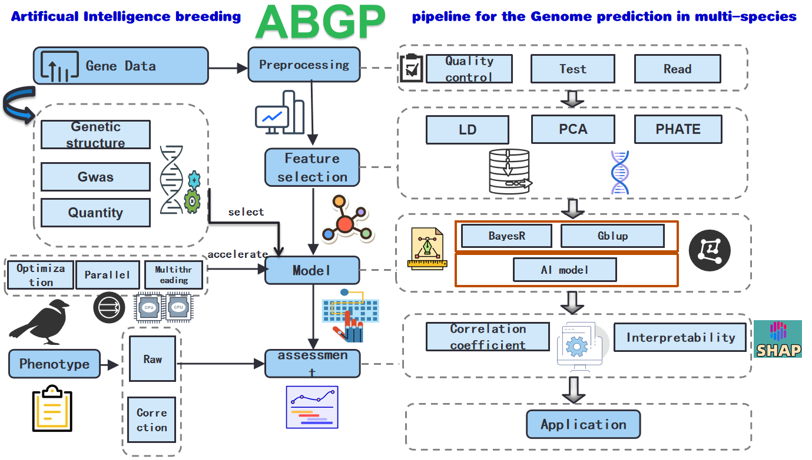

# ABGP软件说明书目录

1. [ABGP简介](#abgp简介)
2. [安装指南](#安装指南)
3. [功能介绍](#功能介绍)
    - [数据预处理](#数据预处理)
    - [特征工程](#特征工程)
    - [模型训练](#模型训练)
    - [模型评估](#模型评估)
    - [模型可解释性](#模型可解释性)
4. [参数介绍](#参数介绍)
5. [使用指南](#使用指南)
    - [快速入手](#快速入手)
    - [详细教程](#详细教程)
    - [示例说明](#示例说明)

## 1. ABGP简介

随着测序技术的发展和高通量基因型数据的产生，育种技术正由传统的“经验育种”逐步向“精准育种”转化。人工智能算法不需要预先的规则定义，通过数据和特征进行自主学习，擅长拟合数据中的非线性复杂关系，对于处理海量基因型数据更具有优势。将人工智能算法应用在基因组预测中，对于进一步提高重要表型育种值估计的准确性，加快遗传进展和育种进程具有重要意义。

Artificial Intelligence Breeding Pipeline(ABGP)是一款集特征选择、模型构建、速度优化、参数调节、位点可解释性于一体的AI育种软件，可以融合先验信息、场季效应、性别、批次等多种协变量信息，针对质量性状和数量性状，包含多种不同的AI算法模型，支持cpu、gpu计算的同时加入多进程、多线程、最优化迭代、网格搜索、麻雀搜索、SNP位点可解释性分析等模块。

整体具有以下特征：

1. 大幅提升预测速度：ABGP支持数据读取加速和GPU模型训练加速，在处理大规模数据时表现尤为出色。
2. 灵活性和适应性：机器学习方法可以处理不同类型的数据和任务，包括回归、分类以及具有复杂非线性关系的数据。这使得它们在处理复杂的基因组数据时更加灵活和高效。
5. 非线性拟合优化：机器学习模型可以自动进行特征选择，并通过SHAP（SHapley Additive exPlanations）等方法评估特征重要性，提供对预测结果的深入理解和解释。
6. 高性能和精度预测：通过使用先进的模型，可以显著提高预测的精度和性能。这些模型通过高效的梯度提升技术，能够在处理大规模数据和复杂模型时表现出色。
7. 自动化调参：机器学习软件集成了网格搜索和智能算法（如SSA）进行自动化调参，确保模型在不同数据集上的最佳表现。而GBLUP方法通常需要手动调参，效率较低。
8. 协变量处理：ABGP可以直接处理数据中的分类变量，自动进行编码和处理，而传统GBLUP方法在处理分类变量时较为复杂，需要额外的预处理步骤。

此外，ABGP通过麻雀搜索等多种参数优化方法进一步提升预测准确性，可以根据SNP在模型中的权重挖掘与表型相关的SNP位点。通过多种方法评估SNP位点重要性，一般SNP位点的权重越大，与表型的相关性越强。此外，通过SHAP理论进行模型可解释性的输出，包括自定义选择特征位点进行重要性排序、基于单样本、多样本与特征结合进行局部和全局性交互解释，并进行可视化展示等。用户可自定义不同特征及样本之间的交互关系进行进一步研究。建议用户将ABGP不同方法提供的各SNP的权重与GWAS结果对比参考，排除各自方法中的假阳性结果，提高可信度。

ABGP在大数据时代，应对基因组数据分析需求方面展现了强大的优势，能够高效、准确地进行大规模数据的预测和分析。为AI育种提供了新的工具和软件平台。

**源代码地址：https://github.com/ABGP**
**附加数据： https://github.com/ABGP/data**
**联系我们：leiwei@cau.edu.cn***

* [ ] **注意：软件仅用于学术使用，商业使用需先联系我们。解释权归畜禽生物育种全国重点实验室所有**


## 2. 安装指南

### 克隆项目仓库

克隆项目的GitHub仓库到本地机器上。打开终端并执行以下命令：

```bash
git clone https://github.com/leiweiucas/ABGP
cd ABGP
```

### 创建虚拟环境
为确保依赖项之间没有冲突，建议使用虚拟环境。可以使用 venv 或 conda 来创建虚拟环境。使用 venv 创建虚拟环境：

```bash
python3 -m venv venv
source venv/bin/activate  # Linux/macOS
venv\Scripts\activate  # Windows
```
### 使用 conda 创建虚拟环境：

```bash
conda create --name ABGP_env python=3.8
conda activate ABGP
```
### 安装依赖项
依赖项列在 requirements.txt 文件中。执行以下命令安装：
```bash
pip install -r requirements.txt
```
requirements.txt 中具体包版本为：

```bash
pandas==1.3.3
numpy==1.21.2
scipy==1.7.1
scikit-learn==0.24.2
matplotlib==3.4.3
catboost==1.0.4
lightgbm==3.2.1
phate==1.0.7
shap==0.39.0
joblib==1.1.0
```
**plink安装**
ABGP软件内置plink模块，下载plink软件后，在Linux或macOS上，编辑 ~/.bashrc 或 ~/.zshrc 文件：
```bash
export PATH=$PATH:/path/to/plink
```
在Windows上，通过系统属性中的“环境变量”选项进行配置。

## 3. 功能介绍

### 数据预处理
程序的预处理模块支持对输入的基因型数据的基因型频率(次等位基因频率)、基因型缺失率、样本缺失率进行统计并以直方图的形式展示并输出。方便用户了解数据整体情况，制定后续的研究方法。

表型文件预处理中，会判断表型值是否有缺失，如果有缺失，会将缺失值对应的行和基因型相对应的样本自动进行删除。并对表型值进行分布直方图的可视化。

###  特征工程
在基因型和表型数据的处理中，特征工程不仅可以有效减少数据维度，降低计算复杂度，还可以保留数据的主要信息。ABGP软件支持两种降维方法：PCA（主成分分析）和 PHATE（潜在拓扑保持嵌入）。

**PCA（Principal Component Analysis，主成分分析）**
PCA是一种常用的降维技术，通过正交变换将高维数据映射到低维空间，保留数据中的主要信息。PCA的主要优点是能够降低数据的维度，同时尽量保留数据的方差信息，从而简化模型的复杂度，提高计算效率。

**PHATE（Potential of Heat-diffusion for Affinity-based Transition Embedding，潜在拓扑保持嵌入）**
PHATE是一种最新的降维技术，它无需先验分布，使用梯度下降和矩阵分解技术来保留数据的潜在几何结构和拓扑特征，通过使用数据点之间的几何距离信息来捕获局部和全局非线性结构。PHATE被设计用来处理数据点之间嘈杂的非线性关系。PHATE生成一个低维表示，它在数据集中同时保留本地和全局结构，因此您可以根据数据集中出现的单元之间关系的图进而形成对数据结构的全局认识。

### 模型训练
本软件支持多种机器学习模型，适用于质量性状和数量性状的预测。其中，质量性状共包含10种不同的机器学习模型，数量性状共包含11种不同的机器学习模型。ABGP所包含的训练方法分为4类，包含基于特征距离的非线性方法、线性方法、bagging\boosting类算法，其中在数量性状中，非线性方法为knn和svm，线性方法为LinearRegressionRidge RegressionElasticNet bagging方法为RF，boosting类算法包括梯度提升树，xgboost，catboost，lightgbm和catboost。在质量性状中，非线性方法为knn和svm，线性方法为逻辑回归 bagging方法为RF，决策树算法。boosting类算法包括梯度提升树，xgboost，catboost，lightgbm和catboost。

用户可以根据具体需求选择合适的模型进行训练，并在训练过程中进行不同方法的参数优化以获得最佳性能。

### 模型评估
在ABGP中，对于质量性状，采用准确率作为评价。对于数量性状，采用预测值和真实值的皮尔逊相关系数作为评价标准。当使用交叉验证时，则采用教程验证的平均值作为准确性的评价标准。

### 模型可解释性
在机器学习模型中，解释模型的预测结果对于理解模型行为和建立信任至关重要。SHAP（SHapley Additive exPlanations）是一种基于博弈论的方法，用于解释模型的输出。它通过计算每个特征对预测结果的贡献，提供全局和局部的解释能力。ABGP软件集成了SHAP中的多种功能，用于分析和解释模型的特征及样本的重要性，以及对表型的贡献。

## 4. 参数介绍
以下为ABGP中所有参数汇总：
```bash
--geno: 输入特征数据文件的路径（必须）
--geno_sep: 输入特征数据文件的分隔符（必须）
--phe: 输入标签数据文件的路径（必须）
--phe_sep: 输入标签数据文件的分隔符（必须）
--phe_col_num: 标签数据所在的列号（必须）
--category_cols: 指定哪些列是分类变量（可选）
--type: 任务类型，sort（分类）或 regression（回归）（必须）
--dim_reduction: 降维方法，可选 None pca phate（可选）
--n_components: 降维后的维度数（可选）
--model: 选择的模型名称（可选）
--model_params: 模型参数，以 JSON 格式传递（可选）
--cv: 交叉验证折数（可选）
--train_size: 训练集占比（可选）
--ntest: 测试集大小（可选）
--process_x: 是否对特征数据进行预处理（可选）
--process_y: 是否对标签数据进行预处理（可选）
--grid: 是否使用网格搜索（可选）
--grid_model_params: 网格搜索的参数，以 JSON 格式传递（可选）
--ssa: 是否使用 SSA 搜索（可选）
--ssa_model_params: SSA 搜索的参数，以 JSON 格式传递（可选）
--all: 训练所有模型，可选 regression 或 sort（可选）
--shap: 计算并可视化 SHAP 值（可选）
--shap_beeswarm: 计算并可视化 SHAP 蜂群图（可选）
--shap_feature_heatmap计算并可视化 SHAP 热图（可选）
--shap_feature_waterfall计算并可视化 SHAP 瀑布图（可选）
--top_features: 指定 SHAP 图中显示的前 N 个特征数目（可选）
--output: 指定保存 SHAP 图像的路径（可选）
--model_path后面指定参考群训练好的模型参数文件。


```

具体机器学习模型中的参数为：

**对于质量形状的分类模型：**

**KNeighborsClassifier**

n_neighbors: 邻居数量（默认为 5），控制了分类的近邻数量。
weights: 权重函数（可选 'uniform' 'distance'），定义了每个邻居对分类结果的影响。
algorithm: 用于计算最近邻居的方法（可选 'auto' 'ball_tree' 'kd_tree' 'brute'）。
leaf_size: 构造树时的叶子节点大小，影响构建和查询速度。
p: 距离度量参数，当 p=1 时为曼哈顿距离，当 p=2 时为欧氏距离。

**LogisticRegression**

penalty: 惩罚类型（可选 'l1' 'l2' 'elasticnet' 'none'），定义了正则化方法。
C: 正则化强度，值越小表示越强的正则化。
solver: 优化算法（可选 'newton-cg' 'lbfgs' 'liblinear' 'sag' 'saga'）。
max_iter: 最大迭代次数，控制优化过程的迭代次数。
class_weight: 类别权重（可选 'balanced' None 或字典），用于处理类别不平衡问题。

**DecisionTreeClassifier**

criterion: 分裂质量的衡量标准（可选 'gini' 'entropy'）。
splitter: 分裂策略（可选 'best' 'random'）。
max_depth: 树的最大深度，限制树的生长以防止过拟合。
min_samples_split: 分裂一个内部节点所需的最小样本数。
min_samples_leaf: 叶子节点所需的最小样本数。

**XGBClassifier**

n_estimators: 树的数量（迭代次数）。
learning_rate: 学习率，控制每次迭代的权重步长。
max_depth: 树的最大深度，防止过拟合。
subsample: 每次迭代前随机选择的样本比例，防止过拟合。
colsample_bytree: 构建每棵树时随机选择的特征比例。

**CatBoostClassifier**

iterations: 训练的迭代次数（树的数量）。
learning_rate: 学习率，控制每次迭代的步长。
depth: 树的深度，影响模型的复杂性。
l2_leaf_reg: L2 正则化系数，防止过拟合。
border_count: 数值特征的边界数量，用于分箱。

**SVC**

C: 正则化参数，值越大表示对误分类的惩罚越大。
kernel: 核函数类型（可选 'linear' 'poly' 'rbf' 'sigmoid'）。
degree: 多项式核函数的度，仅在 kernel='poly' 时有效。
gamma: 核函数系数，控制 RBF poly 和 sigmoid 的影响范围。
class_weight: 类别权重，用于处理类别不平衡问题。
GradientBoostingClassifier

n_estimators: 弱学习器（树）的数量。
learning_rate: 学习率，缩小每个弱学习器的贡献。
max_depth: 每个弱学习器的最大深度。
min_samples_split: 分裂一个内部节点所需的最小样本数。
min_samples_leaf: 叶子节点所需的最小样本数。

**LGBMClassifier**

num_leaves: 树中叶子的最大数目。
learning_rate: 学习率，控制每次迭代的步长。
n_estimators: 树的数量（迭代次数）。
max_depth: 树的最大深度，防止过拟合。
feature_fraction: 每次迭代中使用特征的比例。

**AdaBoostClassifier**

n_estimators: 基础学习器的数量。
learning_rate: 学习率，缩小每个基础学习器的贡献。
algorithm: 提升算法（可选 'SAMME' 'SAMME.R'）。
base_estimator: 基础学习器。
random_state: 随机数种子，用于保证结果的可重复性。

**RandomForestClassifier**

n_estimators: 森林中的树的数量。
max_features: 分裂时考虑的最大特征数。
max_depth: 树的最大深度。
min_samples_split: 分裂一个内部节点所需的最小样本数。
min_samples_leaf: 叶子节点所需的最小样本数。


**对于数量形状的回归模型：**

**LinearRegression**

fit_intercept: 是否计算截距项（默认为 True）。
normalize: 是否在回归前标准化特征（默认为 False）。
copy_X: 是否复制 X 矩阵（默认为 True）。
n_jobs: 用于计算的 CPU 核数（默认为 None，表示使用一个核）。
positive: 是否强制回归系数为正（默认为 False）。

**BayesianRidge**

n_iter: 最大迭代次数（默认为 300）。
tol: 收敛阈值（默认为 1e-3）。
alpha_1: shape parameter for the Gamma distribution prior over the alpha parameter（默认为 1e-6）。
alpha_2: Inverse scale parameter for the Gamma distribution prior over the alpha parameter（默认为 1e-6）。
lambda_1: Shape parameter for the Gamma distribution prior over the lambda parameter（默认为 1e-6）。

**ElasticNet**

alpha: 常规化强度（默认为 1.0）。
l1_ratio: ElasticNet 混合参数，范围在 [0 1] 之间（默认为 0.5）。
fit_intercept: 是否计算截距项（默认为 True）。
normalize: 是否在回归前标准化特征（默认为 False）。
max_iter: 最大迭代次数（默认为 1000）。


**SVR**

kernel: 核函数类型（可选 'linear' 'poly' 'rbf' 'sigmoid'）。
degree: 多项式核函数的度，仅在 kernel='poly' 时有效（默认为 3）。
gamma: 核函数系数，控制 RBF poly 和 sigmoid 的影响范围（默认为 'scale'）。
C: 正则化参数，值越大表示对误差的惩罚越大（默认为 1.0）。
epsilon: 在 epsilon-tube 内的误差不受惩罚（默认为 0.1）。

**KNeighborsRegressor**

n_neighbors: 邻居数量（默认为 5），控制了回归的近邻数量。
weights: 权重函数（可选 'uniform' 'distance'），定义了每个邻居对回归结果的影响。
algorithm: 用于计算最近邻居的方法（可选 'auto' 'ball_tree' 'kd_tree' 'brute'）。
leaf_size: 构造树时的叶子节点大小，影响构建和查询速度。
p: 距离度量参数，当 p=1 时为曼哈顿距离，当 p=2 时为欧氏距离。

**RandomForestRegressor**

n_estimators: 森林中的树的数量（默认为 100）。
criterion: 分裂质量的衡量标准（默认为 'mse'，可选 'mse' 'mae'）。
max_depth: 树的最大深度（默认为 None）。
min_samples_split: 分裂一个内部节点所需的最小样本数（默认为 2）。
min_samples_leaf: 叶子节点所需的最小样本数（默认为 1）。

**AdaBoostRegressor**

n_estimators: 基础学习器的数量（默认为 50）。
learning_rate: 学习率，缩小每个基础学习器的贡献（默认为 1.0）。
loss: 提升算法中的损失函数（可选 'linear' 'square' 'exponential'）。
base_estimator: 基础学习器（默认为 DecisionTreeRegressor）。
random_state: 随机数种子，用于保证结果的可重复性。

**GradientBoostingRegressor**

n_estimators: 弱学习器（树）的数量（默认为 100）。
learning_rate: 学习率，缩小每个弱学习器的贡献（默认为 0.1）。
max_depth: 每个弱学习器的最大深度（默认为 3）。
min_samples_split: 分裂一个内部节点所需的最小样本数（默认为 2）。
min_samples_leaf: 叶子节点所需的最小样本数（默认为 1）。

**XGBRegressor**

n_estimators: 树的数量（迭代次数）（默认为 100）。
learning_rate: 学习率，控制每次迭代的权重步长（默认为 0.1）。
max_depth: 树的最大深度，防止过拟合（默认为 6）。
subsample: 每次迭代前随机选择的样本比例，防止过拟合（默认为 1）。
colsample_bytree: 构建每棵树时随机选择的特征比例（默认为 1）。

**CatBoostRegressor**

iterations: 训练的迭代次数（树的数量）（默认为 1000）。
learning_rate: 学习率，控制每次迭代的步长（默认为 0.03）。
depth: 树的深度，影响模型的复杂性（默认为 6）。
l2_leaf_reg: L2 正则化系数，防止过拟合（默认为 3）。
border_count: 数值特征的边界数量，用于分箱（默认为 254）。

**LGBMRegressor**

num_leaves: 树中叶子的最大数目（默认为 31）。
learning_rate: 学习率，控制每次迭代的步长（默认为 0.1）。
n_estimators: 树的数量（迭代次数）（默认为 100）。
max_depth: 树的最大深度，防止过拟合（默认为 -1，表示不限深度）。
feature_fraction: 每次迭代中使用特征的比例（默认为 1.0）。
各个模型的所有详细参数，详见Scikit-Learn文档
用户可根据不同的机器学习算法自己搭配不同的参数进行训练，若不指定特定参数，则按默认参数进行模型训练。

## 5. 使用指南
### 快速入手
基因型文件支持（vcf、ped格式的文件），对于基因组文件，我们建议用户自行进行基因型填充。当准备好填充后的基因型文件时，将所有表型值和协变量等信息放在同一个文件中，如下表所示，第一、二列为固定效应，第三列第四列为表型值。
并指定分隔符。


| 20 | 0  | 160 | 119 |
|----|----|-----|-----|
| 20 | 0  | 161 | 119 |
| 20 | 0  | 161 | 117 |
| 20 | 0  | 161 | 110 |
| 20 | 0  | 165 | 101 |
| 20 | 0  | 157 | 130 |
| 20 | 0  | 155 | 121 |
| 20 | 0  | 154 | 124 |
| 20 | 0  | 160 | 124 |
| 20 | 0  | 158 | 103 |
| 20 | 0  | 164 | 112 |
| 20 | 0  | 166 | 85  |
| 20 | 0  | 158 | 112 |
| 20 | 0  | 160 | 127 |
| 20 | 0  | 156 | 96  |


以基因型文件为 test_geno.ped 表型文件为 test_phe 文件为例，test_phe 文件第三列为表型真值，进行模型的评估。此时， --geno 后加基因型文件的位置，--phe 后加表型文件的位置，--x_sep 后指定基因型文件的分隔符，--y_sep 后指定表型文件中的分隔符。--y_col_num 后指定表型文件的列数。当不使用交叉验证时，通过 train_size 指定样本训练群体和验证群体的比例。当性状为数量性状时，指定 --type 后为 regression 当为质量性状时，--type 后为 sort。--model 后面加模型的方法，所有方法详见第四部分。当使用 LinearRegression 方法时，且以第三列作为训练表型值时，命令如下。

```bash
ABGP train.py --geno data/test_geno.ped --x_sep \t --phe data/test_phe.txt --y_sep \s --y_col_num 3 --type regression --model LinearRegression --train_size 0.8
```
当使用 test_phe 文件中的第一列、第二列作为协变量时，--category_cols 后面加 12，指定固定效应的列数，如多列则用空格分开。命令如下：
```bash
ABGP train.py --geno data/test_geno.ped --x_sep \t --phe data/test_phe.txt --y_sep \s --y_col_num 3 --type regression --model LinearRegression --category_cols 12
```
###  详细教程

#### 读取数据
--x: 输入特征数据文件的路径
--y: 输入标签数据文件的路径
参数 --x_sep 和 --y_sep 用于指定基因型文件和表型文件的分隔符。使用时，固定效应和表型性状放在同一个文件当中，并人为选择分隔符。如果设置了 --category_cols，则将指定的列为固定效应变量，如有多个，则用逗号进行分隔。--y_col_num 后指定表型值的列索引。--category_cols: 指定固定效应的列索引。

#### 基因型数据预处理
基因型数据预处理模块的功能包括：提取指定样本ID、SNPID的基因型数据，统计并直方图的形式展示SNP缺失率、杂合率，基因型重编码等。为程序下游分析提供数据及可接受的文件格式。目前ABGP支持的基因型文件输入格式有 ped、vcf、txt 格式，若为 ped 和 vcf 格式，只需 plink 标准格式输入即可。若为 txt 格式，则需按以下格式进行输入。每行为一个样本，列为分型后的SNP位点。无索引列和头文件行。参数 --process_x ，对基因型文件进行预处理。

#### 表型数据预处理
参数 --process_y 对表型文件进行预处理，对于数量性状而言，会判断表型值是否有缺失，如果有缺失，会将缺失值对应的行和基因型相对应的样本自动进行删除。并对表型值进行分布直方图的可视化。

#### 特征工程降维
支持 pca、phate 两种方法进行基因型数据的降维：

bash
--dim_reduction pca  --n_components 20
--dim_reduction phate --n_components 20
--dim_reduction 后加降维的方法：phate 或 pca
--n_components 后加降维的成分 n

#### 构建模型

模型训练模块包含多种不同的AI算法。

根据 --type 参数选择回归模型或分类模型。sort（分类）或 regression（回归）

使用 --model 指定的模型进行训练。对于质量性状，后面方法可接：

**KNeighborsClassifier
LogisticRegression
DecisionTreeClassifier
XGBClassifier
CatBoostClassifier
SVC
GradientBoostingClassifier
LGBMClassifier
AdaBoostClassifier
RandomForestClassifier**

对于数量性状，可接：

**LinearRegression
BayesianRidge
ElasticNet
Ridge
SVR
KNeighborsRegressor
RandomForestRegressor
AdaBoostRegressor
GradientBoostingRegressor
XGBRegressor
CatBoostRegressor
LGBMRegressor**

--model_params 后接模型参数，以 JSON 格式传递，当使用任何一种模型进行训练时，均可自由指定训练参数，并以 JSON 格式进行传递。

--cv 根据 --cv 设置的交叉验证折数进行模型训练和评估。如果未设置 --cv，则只进行一次训练。则需指定 --train_size 或 --ntest，且 --train_size 和 --ntest 只需选择一个参数，当设置 --train_size 为 0.8 时，则参考群体中的4/5用于训练，1/5用于评估预测准确性。若设置 --ntest，则为前 n 个样本为训练群体。

如果使用网格搜索（--grid），则需使用 --grid 参数，根据 --grid_model_params 指定的参数进行网格搜索调参。

如果使用 SSA 搜索（--ssa），则需使用 --ssa_model_params 参数，根据 --ssa_model_params 指定的参数进行 SSA 搜索调参。

--all 对模型所有方法进行训练，当使用自己数据集时，使用此参数可以自动测试所有模型，并输出结果中效果最好的模型方法和预测准确性。

如果设置了 --all，则需附加 --type 参数，后接 sort 或 regression，可完成对数量性状或质量性状所有模型的预测准确性的比较，并输出平均准确性效果最好的模型和准确性。


#### 候选群预测
ABGP软件结合实际育种现场需求，加入了候选群预测及排名工作。当参考群群体进行准确性评估后，会生成 .m 文件的后缀。此时，可以利用基于参考群训练完成的权重，对候选群体进行预测。此时，--geno 后面需接入候选群体的路径文件，--model_path 后面指定参考群训练好的模型参数文件。

#### 特征重要性分析
如果设置了 --shap 或 --shap_beeswarm，则计算并可视化 SHAP 的各种类型图。

根据 --top_features 指定的特征数量，生成特征重要性图或蜂群图，并保存到 --output 指定的路径。


###  示例说明
以基因型文件和表型文件为示例，共计1000个参考群体，这里展示了文件中的前10个样本。


假设基因型文件如下表所示，这里以plink常用的ped文件为例,文件命名为geno.ped.

| Index | Col1  | Col2  | Col3 | Col4 | Col5 | Col6 | Col7 | Col8 | Col9 | Col10 | Col11 | Col12 | Col13 | Col14 | Col15 | Col16 | Col17 | Col18 | Col19 | Col20 | Col21 | Col22 | Col23 | Col24 | Col25 | Col26 | Col27 | Col28 | Col29 | Col30 |
|-------|-------|-------|------|------|------|------|------|------|------|-------|-------|-------|-------|-------|-------|-------|-------|-------|-------|-------|-------|-------|-------|-------|-------|-------|-------|-------|-------|-------|
| 1     | 14107 | 14107 | 0    | 0    | 0    | -9   | T    | T    | T    | A     | G     | A     | A     | C     | C     | C     | C     | C     | G     | T     | C     | G     | G     | C     | C     | A     | A     | A     | A     | G     | C     |
| 2     | 14110 | 14110 | 0    | 0    | 0    | -9   | T    | C    | T    | A     | G     | A     | A     | C     | C     | C     | C     | T     | C     | C     | G     | T     | C     | G     | G     | C     | C     | A     | A     | A     | A     |
| 3     | 14119 | 14119 | 0    | 0    | 0    | -9   | T    | C    | T    | A     | G     | A     | A     | C     | C     | C     | C     | C     | G     | T     | C     | G     | G     | C     | C     | A     | A     | A     | A     | G     | C     |
| 4     | 14120 | 14120 | 0    | 0    | 0    | -9   | T    | C    | T    | A     | G     | A     | A     | C     | C     | C     | C     | C     | G     | T     | G     | G     | C     | C     | A     | A     | A     | A     | G     | G     | C     |
| 5     | 14121 | 14121 | 0    | 0    | 0    | -9   | T    | C    | T    | A     | G     | A     | A     | C     | C     | C     | C     | T     | T     | C     | G     | G     | G     | C     | C     | A     | A     | A     | A     | G     | G     |
| 6     | 14123 | 14123 | 0    | 0    | 0    | -9   | C    | T    | T    | C     | T     | A     | G     | A     | A     | C     | C     | C     | T     | C     | C     | G     | T     | G     | G     | C     | C     | A     | A     | A     | A     |
| 7     | 14125 | 14125 | 0    | 0    | 0    | -9   | T    | T    | T    | A     | A     | A     | C     | C     | C     | T     | C     | C     | C     | C     | G     | T     | G     | G     | C     | C     | A     | A     | A     | A     | G     |
| 8     | 14126 | 14126 | 0    | 0    | 0    | -9   | T    | T    | T    | A     | G     | A     | A     | C     | C     | C     | C     | C     | T     | T     | C     | G     | T     | G     | G     | C     | C     | A     | A     | A     | A     |
| 9     | 14134 | 14134 | 0    | 0    | 0    | -9   | T    | C    | T    | A     | G     | A     | A     | C     | C     | C     | C     | C     | T     | T     | C     | G     | T     | G     | G     | C     | C     | A     | A     | A     | A     |
| 10    | 14135 | 14135 | 0    | 0    | 0    | -9   | T    | T    | T    | A     | G     | A     | A     | C     | C     | C     | C     | T     | C     | C     | G     | T     | G     | G     | C     | C     | A     | A     | A     | A     | G     |


表型文件如下表所示,命名为phe.txt.
A、B列是协变量，C,D列是不同的表型值。


| Index | A  | B  | C   | D   |
| ----- | -- | -- | --- | --- |
| 1     | 20 | 0  | 160 | 119 |
| 2     | 20 | 0  | 161 | 119 |
| 3     | 20 | 0  | 161 | 117 |
| 4     | 20 | 0  | 161 | 110 |
| 5     | 20 | 0  | 165 | 101 |
| 6     | 20 | 0  | 157 | 130 |
| 7     | 20 | 0  | 155 | 121 |
| 8     | 20 | 0  | 154 | 124 |
| 9     | 20 | 0  | 160 | 124 |
| 10    | 20 | 0  | 158 | 103 |


使用示例
**1：训练回归模型：**
```
abgp --geno data/geno.ped  --phe data/phe.csv --y_sep , --y_col_num 3 --type regression --model LinearRegression -train_size 0.8
```


**2.训练分类模型，并使用PCA进行降维(n=10)：**

```
abgp --geno data/geno.ped --x_sep , --y data/phe.csv --y_sep , 
--y_col_num 3 --type sort --dim_reduction pca --n_components 10 --model 
LogisticRegression --train_size 0.8
```


**3.网格搜索并进行五折交叉验证：**

```
abgp --geno data/geno.ped , --phe data/phe.csv --y_sep , --y_col_num 3 --type regression --model LinearRegression --grid true --grid_model_params 
'{"fit_intercept": [true, false]}' --cv 5
```


**4.在质量性状中，处理协变量并训练catboost模型：**

```
abgp --geno data/geno.ped  --phe data/phe.csv --y_sep , --y_col_num 3 --type sort --model CatBoostClassifier --category_cols 1,2 --cv 5
```

**5.在数量性状中，计算并保存 SHAP 值和蜂群图，取排名前10的特征，并指定输出路径到shap_outputs文件夹:**
````
abgp --geno data/geno.ped --phe data/phe.csv --y_sep , --y_col_num 3 --type regression --model LGBMRegressor --shap --shap_beeswarm --top_features 10 --output shap_outputs/ --cv 5
````

**6.一次性训练所有模型，输出效果最好的模型的名称和对应的准确性。当表型为数量性状时，--type 后加regression,当表型为质量性状时，--type后加sort:**

```
abgp --geno data/geno.ped --phe data/phe.csv --y_sep , --y_col_num 3 --all --type regression --shap --shap_beeswarm --top_features 50 --output shap_outputs/ --cv 5
```

**7.在参考群评估完预测准确性后，需在候选群体中进行候选群体的预测。
此时--geno 后接候选群的基因型文件，--model_path后指定参考群中不同算法训练好的模型权重。此时无需指定表型列，若需加入协变量，则指定表型文件中协变量的列数:此时输出候选群体中的预测结果。**

````python
abgp predict.py --geno data/geno.ped -phe data/phe.csv --y_sep , 
--category_cols 1,2 --model_pathcheckpoins/LinearRegression_general_20231027.m 
````


